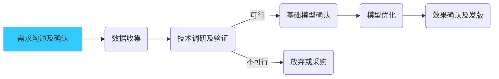

### 开发基础信息

 1. 基础信息

    版本：V2.0 funasr asr

    模型负责人：NutshellLee

    开发人员：NutshellLee

    

 2. 开发进度

​	2. 时间节点:

| 时间节点               | 时间         | 备注 |
| ---------------------- | ------------ | ---- |
| 数据收集及评价方法     | ~~2024-4-1~~ | -    |
| base模型效果及模型确认 | ~~2024-4-7~~    | -    |
| 模型封装部署           | ~~2024-4-22~~    | -    |
| 写所有文档           | ~~2024-4-23~~    | -    |
| 合并2pass服务、写文档    | ~~2024-9-9~~    | -    |
